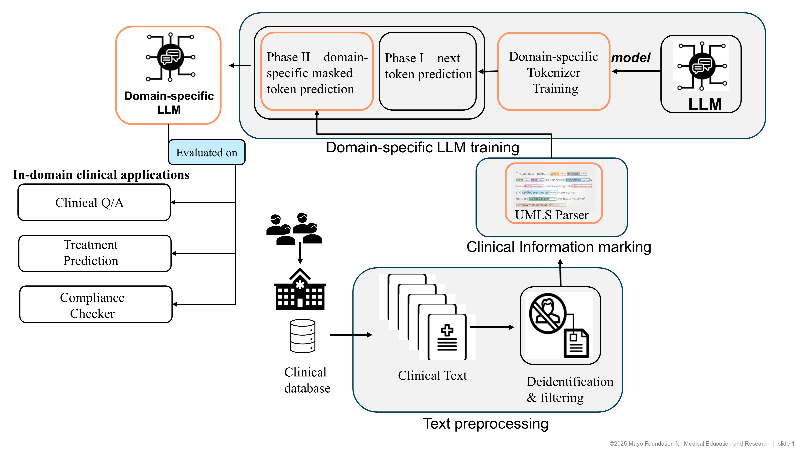

# From-scratch Development of LLM and Tokenizer

The repo contains code to train a tokenizer and a decoder-only LLM from scratch 

## Domain-trailoring

The repo is designed to develop an LLM for prostate cancer with clinical notes of prostate cancer patients, their radiology and pathology reports, and published literature regarding prostate cancer

- Domain-specific tokenizer: tends to cover domain-specific terminology in single (or few) token(s) instead of chopping them into smaller incomprehensible tokens 
- UMLS parsing: identification of clinical terminology in freetext clinical data
- Phase-I training: standard next token prediction
- Phase II training: clinical token prediction, domain-focused learning

## Downstream tasks

- Clinical term retrieval
- Clinical Q&A (repo coming soon)
- Treatment prediction (repo coming soom)
